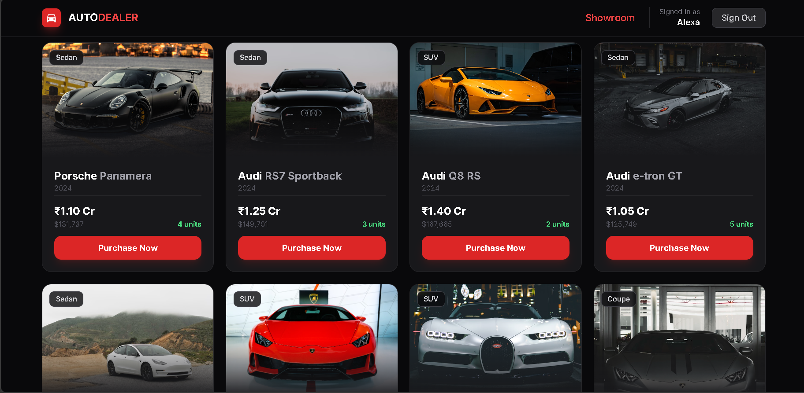
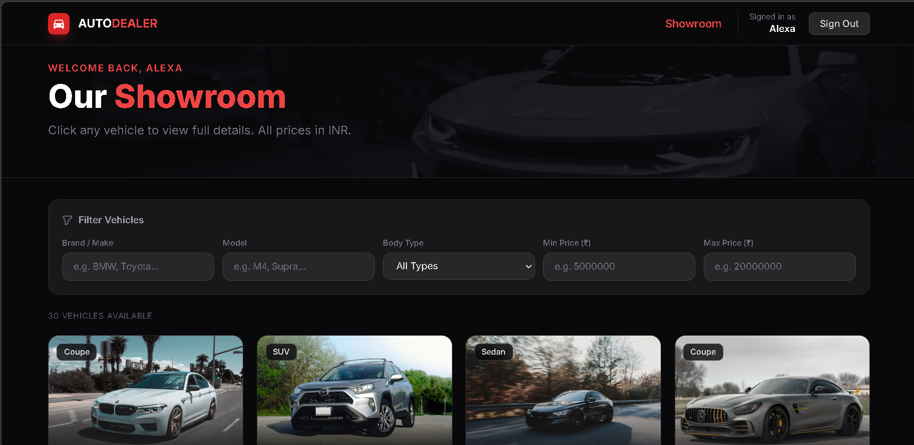
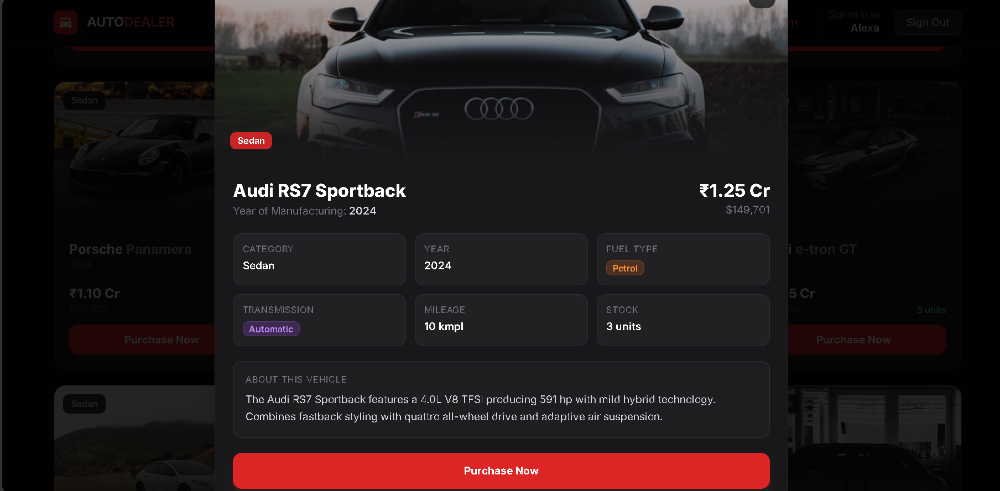
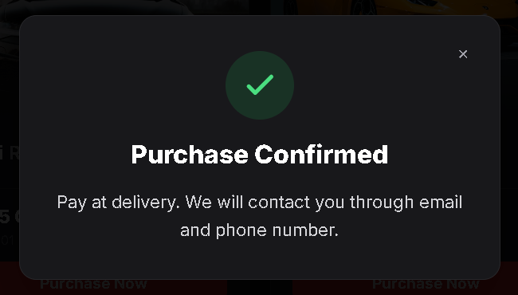
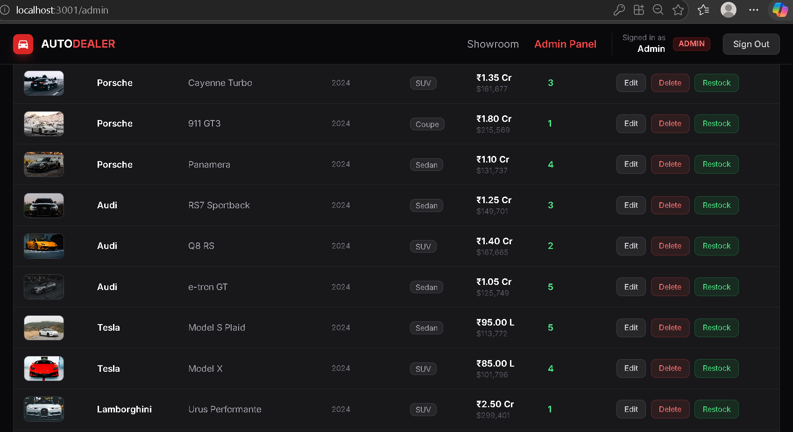
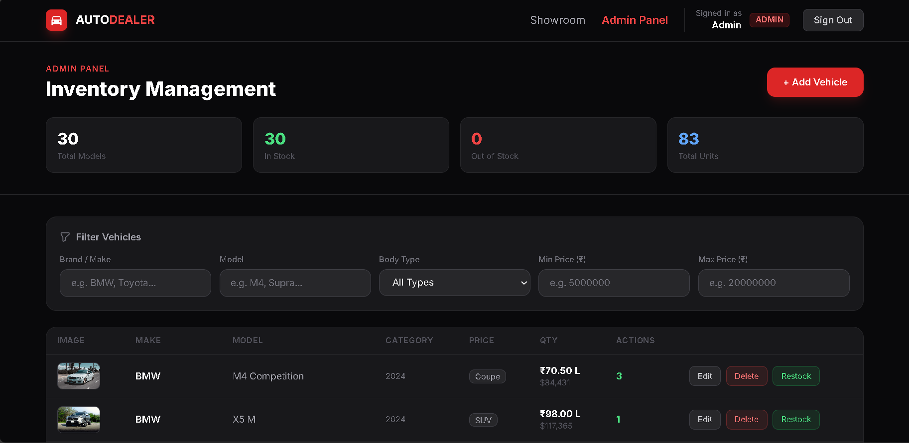

# Car Dealership Inventory System

A full-stack inventory system where customers can browse, filter, and purchase vehicles, while administrators manage the catalogue and stock.

## Features

### Customer Features

- User registration and login
- JWT-based authentication
- Secure password hashing using bcrypt
- Browse available vehicles
- Search vehicles by make and model
- Filter vehicles by:
  - Make
  - Model
  - Category
  - Price range
  - Year
  - Fuel type
  - Transmission
- View complete vehicle details
- View similar vehicle models
- View prices in INR with approximate USD equivalent
- Purchase vehicles
- Automatic stock reduction after successful purchase
- Purchase disabled when stock reaches zero
- Logout functionality

### Admin Features

- Secure administrator authentication
- Role-based authorization
- Add new vehicles
- Update vehicle details
- Delete vehicles
- Restock vehicles
- Manage vehicle inventory
- View and filter the complete vehicle catalogue

## Technology Stack

| Layer | Technology |
| --- | --- |
| Frontend | React, React Router, Axios, Tailwind CSS |
| Backend | Node.js, Express |
| Database | MySQL (`mysql2`) |
| Authentication | JSON Web Tokens, bcryptjs |
| Testing | Jest, Supertest |

## Architecture

The React client calls the Express REST API. Routes apply authentication and administrator middleware before controllers delegate business rules to services. Models are the only layer that performs MySQL queries.

```
React UI -> Express routes -> middleware -> controllers -> services -> models -> MySQL
```

## Folder Structure

```
car-dealership/
├── backend/
│   ├── src/
│   │   ├── config/        # database pool and schema
│   │   ├── controllers/
│   │   ├── middleware/
│   │   ├── models/
│   │   ├── routes/
│   │   ├── services/
│   │   ├── tests/
│   │   ├── app.js
│   │   └── server.js
│   ├── .env.example
│   ├── .env.test.example
│   └── package.json
├── frontend/
│   ├── public/
│   ├── src/
│   │   ├── api/
│   │   ├── components/
│   │   ├── context/
│   │   ├── pages/
│   │   └── utils/
│   └── package.json
├── PROMPTS.md
├── README.md
└── .gitignore
```

## MySQL Setup and Schema

Create separate development and test databases, then load the same schema into each:

```bash
mysql -u root -p -e "CREATE DATABASE IF NOT EXISTS car_dealership;"
mysql -u root -p -e "CREATE DATABASE IF NOT EXISTS car_dealership_test;"
mysql -u root -p car_dealership < backend/src/config/schema.sql
mysql -u root -p car_dealership_test < backend/src/config/schema.sql
```

The schema has two tables:

| Table | Purpose | Key fields |
| --- | --- | --- |
| `users` | Accounts and roles | `id`, `name`, unique `email`, `password_hash`, `role` |
| `vehicles` | Inventory | `id`, `make`, `model`, `category`, `year`, `price`, `quantity`, vehicle details, `image_url` |

`users.email`, vehicle make/model, category, and year are indexed. The complete DDL is in [schema.sql](backend/src/config/schema.sql).

## Environment Variables

Copy `backend/.env.example` to `backend/.env` and fill in real local values. Do not commit it.

| Variable | Description |
| --- | --- |
| `PORT` | API port; defaults to `3000` |
| `DB_HOST`, `DB_PORT`, `DB_USER`, `DB_PASSWORD`, `DB_NAME` | MySQL connection settings |
| `JWT_SECRET` | Long, random token-signing secret |
| `JWT_EXPIRES_IN` | Token lifetime, for example `1h` |
| `ADMIN_EMAIL`, `ADMIN_PASSWORD` | Required only when seeding a local administrator |

For tests, copy `backend/.env.test.example` to `backend/.env.test` and point `DB_NAME` at `car_dealership_test`.

## Run Locally

### Backend

```bash
cd backend
npm install
# create .env from .env.example and configure MySQL first
node seed.js
npm start
```

The API listens at `http://localhost:3000`. `node seed.js` is optional and intentionally requires `ADMIN_EMAIL` and `ADMIN_PASSWORD`; it creates development catalogue data only.

### Frontend

In another terminal:

```bash
cd frontend
npm install
npm start
```

The client opens at `http://localhost:3001` and proxies API calls to port 3000.

## API Endpoints

| Method | Endpoint | Access | Description |
|--------|----------|--------|-------------|
| `GET` | `/health` | Public | Health check |
| `POST` | `/api/auth/register` | Public | Create a new user account |
| `POST` | `/api/auth/login` | Public | Authenticate user and return JWT |
| `GET` | `/api/auth/me` | Authenticated | Return the currently signed-in user |
| `GET` | `/api/vehicles` | Public | List all vehicles |
| `GET` | `/api/vehicles/search` | Public | Search and filter vehicles |
| `GET` | `/api/vehicles/:id` | Public | Get vehicle details and similar models |
| `POST` | `/api/vehicles` | Admin | Add a new vehicle |
| `PUT` | `/api/vehicles/:id` | Admin | Update vehicle details |
| `DELETE` | `/api/vehicles/:id` | Admin | Delete a vehicle |
| `POST` | `/api/vehicles/:id/purchase` | Authenticated | Purchase an in-stock vehicle |
| `POST` | `/api/vehicles/:id/restock` | Admin | Increase vehicle stock |

## Authentication and Security

Send protected requests with `Authorization: Bearer <token>`. New registrations always receive the `USER` role. Administrator routes require a JWT containing `ADMIN`.

Passwords are hashed with bcrypt before storage. MySQL calls use placeholders rather than string-concatenated values. Environment files are ignored by Git; only non-secret example files are versioned. The backend validates required fields, email/password format, non-negative vehicle values, and positive restock values.

## Testing

```bash
cd backend
npm test
```

The Jest/Supertest suite covers registration, login, hashed passwords, JWT authentication, role authorization, vehicle CRUD, searching/filtering, purchase/zero-stock cases, restocking, validation, and error handling. The tests are organised by feature in `backend/src/tests`, making the expected behavior executable before changes are made.

The frontend has no committed automated UI test suite yet. `npm run build` is used as a production compilation check; registration, login/logout, dashboard filtering, purchase state, admin management, and route access should be exercised manually before submission.
## Screenshots

The following screenshots demonstrate the main features and workflows of the Car Dealership Inventory System.

### Login Page


### Registration Page


### Vehicle Catalogue



### Vehicle Search and Filters



### Vehicle Details




### Purchase Workflow



### Admin Dashboard




### Inventory Management



## My AI Usage

Amazon Q was used during the main development of the project for assistance with project setup, MySQL database integration, authentication, backend APIs, testing, debugging, and frontend development.

Codex was used during the final review and refinement of the project for code review, debugging, test verification, improving error handling, and preparing the project documentation.

AI tools were used as development assistants and their suggestions were reviewed, modified, and tested according to the project requirements. The project was not completely developed by relying on AI. Final implementation decisions, testing, debugging, and local verification were performed by the developer.

Raw AI conversations and prompts used during development are documented in `PROMPTS.md`.